# vkwall-downloader

---

* [Russian Text](#Russian)
* [English Text](#English)

---

## <a name="Russian">Russian README.</a>

VK программа загрузки стены сообщества или человека в структуру папок.

 &nbsp; &nbsp;

## <a name="Oglavlenie">Оглавление</a>

1. [Установка.](#Setup)
2. [Обзор утилиты](#ShowUtilites)
3. [Об авторе.](#About)

---

## <a name="Setup">1. Установка.</a>

Для установки программы воспользуйтесь следующей командой:

```
python setup.py install
```

или

```
python -m pip install .
```

**Точка в конце команды не ошибка!**

Для сборки **&laquo;*.tar.gz&raquo;** архива и **&laquo;*.whl&raquo;** файла библиотеки с зависимостями воспользуйтесь следующей командой:

```
python setup.py sdist bdist_wheel
```

После сборки найдетё указанные файлы в директории **&laquo;./dist&raquo;**.

Для сборки в исполняемый файл вам понадобится дополнительная библиотека - **&laquo;pyinstaller&raquo;**. И для этого её необходимо установить.

```
python -m pip install pyinstaller
```

Затем воспользуйтесь командой компиляции:

```
pyinstaller --onefile --noconsole --icon=image/vk-icon.ico --paths image/ --paths forms/ --paths pyvkwall/ main.py
```

---

[К оглавлению](#Oglavlenie)

---

## <a name="ShowUtilites">2. Обзор утилиты.</a>

Внешне программа выглядит следующим образом.

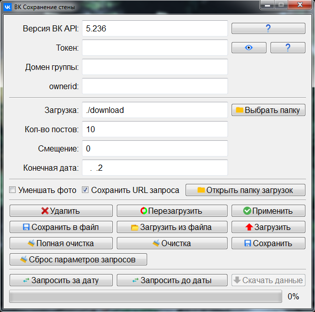

При нажатии на кнопку с первым знаком вопроса и у вас должно открыться окно настроек версии **&laquo;VK API&raquo;**.

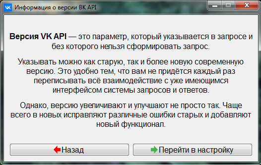

При нажатии на кнопку со вторым знаком вопроса и у вас должно открыться окно настроек **&laquo;ВК Токена&raquo;**.

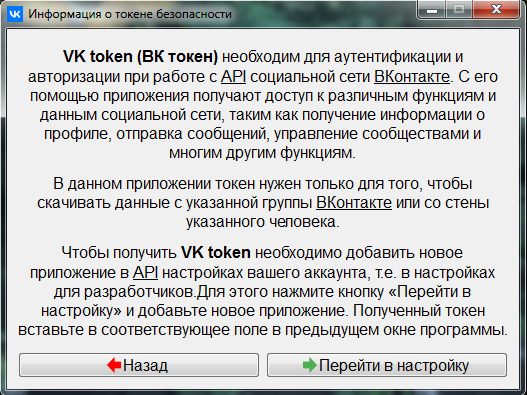

При этом основное окно программы будет временно заблокировано во избежание проблем.

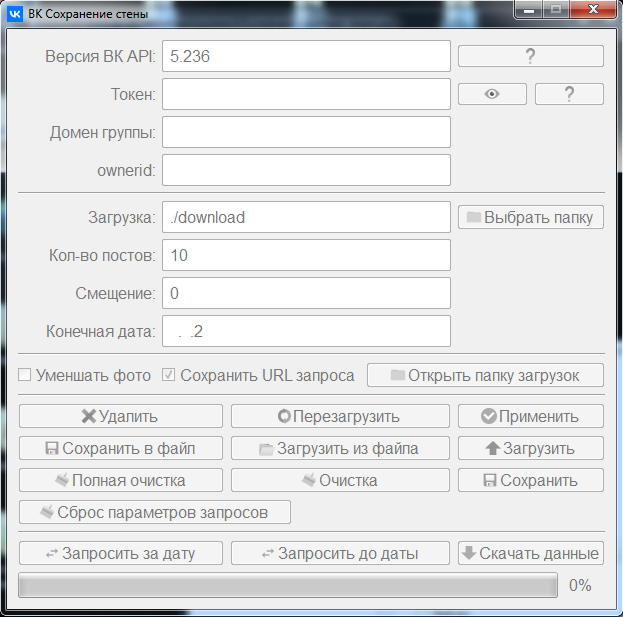

После закрытия предыдущего окна настроек - основное окно программы снова станет доступным.

Рядом со строкой токена имеется кнопка с глазом.

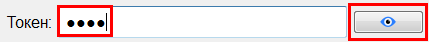

При нажатии на неё кнопка должна изменится, а в строке с токеном все символы должны стать видимыми.

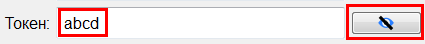

Кнопка **&laquo;Выбрать папку&raquo;** запрашивает у вас местоположение новой директории для сохранения всей скачиваемой информации из Контакта.

<span style="color:red;">Строку <span style="color:blue;">**&laquo;ownerid&raquo;**</span> заполнять не обязательно, если у вас указан <span style="color:green;">**&laquo;Домен группы&raquo;**</span>. Если у вас не указан <span style="color:green;">**&laquo;Домен группы&raquo;**</span>, то строку с <span style="color:blue;">**&laquo;ownerid&raquo;**</span> заполнять обязательно!</span>

**&laquo;Кол-во постов&raquo;** указывает на количество записей, которое необходимо получить при запросе данных со стены. Максимальное значение: 100. Т.е. во время получения записей до указанной даты или за указанную дату программа будет листать в данном примере по 10 записей. Если вам нужно больше точности, просто уменьшите эту цифру или сразу укажите 1. 

**&laquo;Смещение&raquo;** нужно в том, случае, когда у вас имеется закреплённая запись в сообществе. Потому что если у вас давно стоит некая закреплённая запись в качестве первого поста, то при получении новостей со стены и проверки конечной даты на совпадение с датой новости получение данных может прекратится. 

Поэтому если у вас имеется закреплённая запись в качестве первого поста в самом верху сообщества, то просто ставьте цифру **&laquo;1&raquo;**. Если у вас нет закреплённых записей в сообществе, то ставьте **&laquo;0&raquo;**.

Каждый раз после внесения каких-либо изменений в любой строке, а также после установки или снятия галочек **&laquo;Уменьшить фото&raquo;** и **&laquo;Сохранить URL запроса&raquo;** обязательно нажимайте кнопку **&laquo;Применить&raquo;**, чтобы изменения были применены.

Флажок **&laquo;Уменьшить фото&raquo;** позволяет автоматически уменьшать все найденные и сохраняемые изображения до размера 1024x800 пикселей с сохранением пропорций. Причём в отдельную директорию.

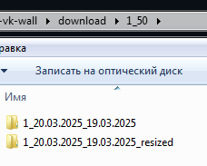

Кнопка **&laquo;Перезагрузить&raquo;** перезагружает всю конфигурацию программы заново. Если вы сохраняли настройки в системе, то настройки будут загружены из системы. В противном случае данные будут сброшены в значения по умолчанию.

Действия кнопок **&laquo;Сохранить&raquo;**, **&laquo;Загрузить&raquo;** и **&laquo;Удалить&raquo;** связаны друг с другом.

+ При нажатии на кнопку **&laquo;Сохранить&raquo;** введенные данные будут сохранены и в диспетчер учетных данных системы и в отдельный конфигурационный шифрованный файл.
+ При нажатии на кнопку **&laquo;Загрузить&raquo;** сохраненные на предыдущем этапе данные будут автоматически загружены.
+ При нажатии на кнопку **&laquo;Удалить&raquo;** все сохранённые данные диспетчера учетных данных системы будут очищены, т.е. удалены.

Кнопки **&laquo;Сохранить в файл&raquo;** и **&laquo;Загрузить из файла&raquo;** соответственно сохраняют и загружают данные в и из пользовательского отдельного шифрованного конфигурационного файла. 

Если вы, например, не хотите сохранять ваш токен в системе, то можете просто сохранить его в шифрованный пользовательский конфигурационный файл. И далее когда вам понадобится ваш токен, то просто загружать его из этого отдельного файла.

Кнопка **&laquo;Очистка&raquo;** очищает только 2 поля:
+ строку **&laquo;Смещение&raquo;**.
+ и строку **&laquo;Конечная дата&raquo;**.

Кнопка **&laquo;Сброс параметров запросов&raquo;** очищает только 3 строки с данными:
+ **&laquo;Токен&raquo;**
+ **&laquo;Домен группы&raquo;**
+ и **&laquo;ownerid&raquo;**

Кнопка **&laquo;Полная очистка&raquo;** сбрасывает все поля и перезагружает все настройки. Помимо этого все настройки автоматически будут выведены в соответствующие файлы параметров программы для возможности внесения в них изменений. При отсутствии этих файлов все параметры просто автоматически установятся в значения по умолчанию.

Структура папки со всеми загрузками определена следующим образом.

```
download
├───url.txt
├───posts.json
└───1_50
    └───1_текущаяя-дата_конечная-дата-загрузки
        ├───1_дата-новости
        ...
        └───xx_дата-последней-полученной-новости
```

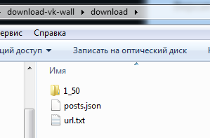

В текстовый файл сохраняется ссылка запроса вместе с токеном, чтобы можно было перепроверить.

В JSON файл сохраняются все запрошенные новости.

Далее во всех вложенных папка встроено ограничение - максимум 100 файлов. Это связано и с ограничениями самих операционных системам, и с различными ограничениями файловых системам. Чтобы пользователи могли без проблем загружать большие объемы данных и в любой Linux системе, и в любой Windows системе.

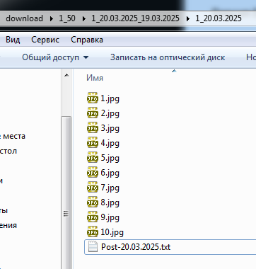

Открываем файл с новостью и получаем следующие данные.

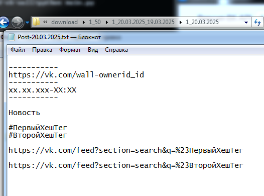

+ Ссылка на саму новость, на случай проблем и недопониманий со стороны пользователей.
+ Полная дата самой новости, чтобы её не приходилось искать и переформатировать.
+ Сама новость
+ Сами Хештеги
+ ссылки на хештеги
+ и другие данные которые удалось сохранить в текстовый вид.

При использовании галочки **&laquo;Уменьшать фото&raquo;** данные структура папок слегка автоматически изменится, чтобы не перезаписывать файлы.


### Пример изменения настроек.

По умолчанию у вас в папке с программой не будет никаких дополнительных файлов.

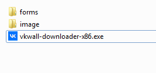

Запустите программу и нажмите на кнопку сброса **&laquo;Полная очистка&raquo;**, согляшаясь с вопросом программы.

После чего у вас автоматически появятся 2 файла настроек в формате **&laquo;JSON&raquo;**.

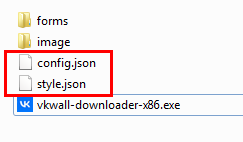

+ **&laquo;config.json&raquo;**
+ и **&laquo;style.json&raquo;**

В стилях вы можете изменить заголовки окон, заголовки кнопок, некоторые виды отступов и размеров и другие виды текстов. 

Не нравится вам русский язык - внесите изменения в файл **&laquo;style.json&raquo;** и наслаждайтесь английским языком.

Давайте специально изменим заголовок главного окна программы.

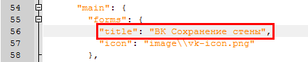

И сделаем его, например таким.

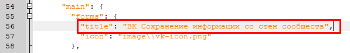

И теперь запускаем программу заново и смотрим на внесённые изменения.

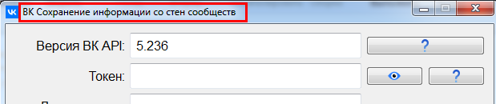

Теперь посмотрим на основные более важные параметры программы.

Конфигурационный файл **&laquo;config.json&raquo;**.

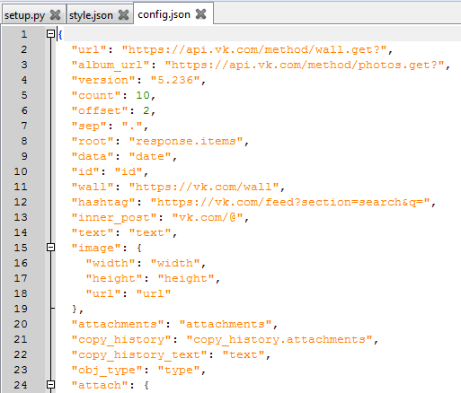

Большинство параметров менять не рекомендуется. Некоторые из этих параметров намеренно записаны через разделитель, т.е. через точку. Например, &laquo;root&raquo; и &laquo;copy_history&raquo;.

Для программы точка является главным разделителем списков объектов получаемых JSON данных с помощью ВК API.

Основные же объекты, которые мы можем сохранить в файлы или хотя бы ссылки на эти объекты находятся в переменной **&laquo;attach&raquo;**.

Каждый объект в этой переменной имеет следующую структуру.

```
    "Наименование-типа": {
      "text": [],
      "save": [],
      "download": true,
      "isone": false,
      "list": "список",
      "ext": "форматы",
      "isimage": false,
      "isalbum": false
    },
```

**&laquo;Наименование типа&raquo;** берётся из загружаемого JSON объекта с данными.

**&laquo;text&raquo;** - список объектов, которые надо сохранить в текстовый файл в качестве текста. Если объект также является списком, просто напишите сюда оба объекта в одну переменную через точку. Например, так: &laquo;"title", "title.description"&raquo;.

**&laquo;save&raquo;** ищет указанные вами переменные в этом списке, также учитывая точку как разделитель списков, и записывает всё в текстовый файл в одну длинную строку. Если переменная не находится, то в файл записывается просто эта же часть строки в качестве значения.

Посмотрите пример как сохраняется ссылка на видео в этом параметре.

**&laquo;download&raquo;** определяет является ли объект загружаемым или нет. Например, изображения, документы и музыка являются загружаемыми. Видео, ссылки и опросы не являются загружаемыми объектами.

**&laquo;isone&raquo;** - является ли представленный объект единственным или имеет вложенный список.

Вложенный список определяется следующим параметром **&laquo;list&raquo;**. Здесь также можно записать переменные через точку.

**&laquo;ext&raquo;** определяет формат файла в который будет сохранён загружаемый объект. Т.е. когда **&laquo;download&raquo;** установлен в **&laquo;true&raquo;**.

**&laquo;isimage&raquo;** определяет является ли объект изображением. 

**&laquo;isalbum&raquo;** - является ли объект альбомом.

Последние 2 параметра используются практически всегда, но по факту применяются только к 2 известным объектам - изображениям и альбомам.

Это сделано специально, чтобы объекты не перемешивались друг с другом и изменения всегда можно было бы вносить извне.

В данный момент известны следующие типы объектов.
+ **&laquo;photo&raquo;** - изображения.
+ **&laquo;album&raquo;** - альбом с изображениями. В прошлом году можно было добавлять на стену целый альбом изображений в качестве целого поста.
+ **&laquo;video&raquo;** - видео. Но здесь можно сохранить только информацию и ссылки.
+ **&laquo;link&raquo;** - прикрепленные к посту ссылки.
+ **&laquo;audio&raquo;** - музыка. Сохраняется в формат MP3.
+ **&laquo;doc&raquo;** - документы с различными форматами.
+ **&laquo;poll&raquo;** - опросы.

---

[К оглавлению](#Oglavlenie)

---

## <a name="about">3. Обо Мне</a>

<details>
	<summary>Подробнее ...</summary>
	
Автор данной разработки **Shadow**: [maximalisimus](https://github.com/maximalisimus).

Имя автора: **maximalisimus**: [maximalis171091@yandex.ru](mailto:maximalis171091@yandex.ru).

Дата создания: **06.03.2025**

</details>

---

[К оглавлению](#Oglavlenie)

---

## <a name="English">English README.</a>

Description.

 &nbsp; &nbsp;

## <a name="EngOglavlenie">Table of contents</a>

1. [Installation.](#SetupEng)
2. [Utility Overview.](#ShowUtilitesEng)
3. [About the author.](#AboutEng)

---

## <a name="SetupEng">1. Installation</a>

To install the program, use the following command:

```
python setup.py install
```

or

```
python -m pip install .
```

**The dot at the end of the command is not a mistake!**

To build **&laquo;*.tar.gz&raquo;** archive and **&laquo;*.whl&raquo;** of the library file with dependencies, use the following command:

```
python setup.py sdist bdist_wheel
```

After the build, you will find the specified files in the directory **&laquo;./dist&raquo;**.

To build it into an executable file, you will need an additional library. - **&laquo;pyinstaller&raquo;**. And for that, it needs to be installed.

```
python -m pip install pyinstaller
```

Then use the compilation command:

```
pyinstaller --onefile --noconsole --icon=image/vk-icon.ico --paths image/ --paths forms/ --paths pyvkwall/ main.py
```

---

[To the table of contents](#EngOglavlenie)

---

## <a name="ShowUtilitesEng">2. Utility Overview.</a>

Externally, the program looks as follows.


When you press the button with the first question sign and you should open the version of the version settings **&laquo;VK API&raquo;**.


When clicking on the button with the second question sign and you should open the settings window **&laquo;ВК Токена&raquo;**.


At the same time, the main window of the program will be temporarily blocked to avoid problems.


After closing the previous settings window - the main window of the program will again become affordable.

There is a button with the eye next to the token line.


When pressing it, the button should change, and in a line with a token, all characters should become visible.


The **&laquo;Select the folder&raquo;** button requests you the location of the new directory to save all the downloaded information from the contact.

<span style="color:red;">Line <span style="color:blue;">**&laquo;ownerid&raquo;**</span> it is not necessary to fill out if you have indicated <span style="color:green;">**&laquo;Group domain&raquo;**</span>. If you are not specified <span style="color:green;">**&laquo;Group domain&raquo;**</span>, then line with <span style="color:blue;">**&laquo;ownerid&raquo;**</span> fill it down!</span>

**&laquo;The number of posts&raquo;** Indicates the number of records that must be obtained when you request data from the wall. Maximum value: 100. i.e. During the receipt of records until the specified date or for the specified date, the program will flip out in this example of 10 records. If you need more accuracy, just reduce this figure or immediately indicate 1. 

**&laquo;Offset&raquo;** it is necessary in the case when you have a fixed entry in the community. Because if you have for a long time a certain fixed entry as the first post, then upon receipt of news from the wall and checking the final date to match the news date, the receipt of data may stop. 

Therefore, if you have a fixed entry as the first post at the very top of the community, then just put the figure **&laquo;1&raquo;**. If you do not have fixed entries in the community, then put **&laquo;0&raquo;**.

Every time after making any changes in any line, as well as after installing or removing checks **&laquo;Reduce photos&raquo;** and **&laquo;Save the URL request&raquo;** be sure to press the button **&laquo;Uses&raquo;**, to make changes applied.

Flag **&laquo;Reduce photos&raquo;** Allows you to automatically reduce all found and saved images to the size of 1024x800 pixels while maintaining proportions. Moreover, in a separate directory.


Button **&laquo;Reload&raquo;** reloads the entire configuration of the program again. If you have saved the settings in the system, then the settings will be loaded from the system. Otherwise, the data will be dropped into default values.

The actions of the buttons **&laquo;Save&raquo;**, **&laquo;Load&raquo;** и **&laquo;Delete&raquo;** related to each other.

+ When clicking on the button **&laquo;Save&raquo;** the entered data will be saved in the dispatcher of the accounting data of the system and to a separate configuration encrypted file.
+ When clicking on the button **&laquo;Load&raquo;** the data stored at the previous stage will be automatically loaded.
+ When clicking on the button **&laquo;Delete&raquo;** all saved data dispatcher of the systems of the systems will be cleared, i.e. Deleted.

Buttons **&laquo;Save to file&raquo;** and **&laquo;Load on files&raquo;** accordingly, data B and from the user separate encrypted configuration file are saved and uploaded. 

If you, for example, do not want to save your token in the system, then you can simply save it in encrypted user configuration file. And then when you need your token, then just download it from this separate file.

Button **&laquo;Clear&raquo;** cleans only 2 fields:
+ line **&laquo;Offset&raquo;**.
+ and line **&laquo;Fine date&raquo;**.

Button **&laquo;Reset parameters of requests&raquo;** cleans only 3 lines with data:
+ **&laquo;Token&raquo;**
+ **&laquo;Group domain&raquo;**
+ и **&laquo;ownerid&raquo;**

Button **&laquo;Full clear&raquo;** it dumps all the fields and restarts all the settings. In addition, all settings will automatically be displayed to the appropriate file parameters for the possibility of making changes to them. In the absence of these files, all parameters are simply automatically set in default values.

The structure of the folder with all loads is determined as follows.

```
download
├───url.txt
├───posts.json
└───1_50
    └───1_Current-data_farty-date-load
        ├───1_Date-News
        ...
        └───xx_Date-last-chopped-ado
```


The query link is saved in the text file along with the token so that it can be double-checked.

In the JSON file, all the requested news are saved.

Further, all the attached folder is built in the restriction - a maximum of 100 files. This is due to both the restrictions on the operating systems themselves, and with various restrictions on file systems. So that users can easily load large volumes of data in any Linux system and in any Windows system.


Open the file with the news and get the following data.


+ Link to the news itself, in case of problems and misunderstandings by users.
+ The full date of the news itself, so that it does not have to search and reformat.
+ The news itself
+ The hashtags themselves
+ Links to hashtags
+ And other data that was saved in a text form.

When using a checkmark **&laquo;Reduce photos&raquo;** this structure of folders will slightly automatically change so as not to rewrite files.


### An example of a change in settings.

By default, you will not have any additional files in the folder with the program.


Run the program and click on the reset button **&laquo;Full clear&raquo;**, sowing the question of the program.

After which you will automatically have 2 settings files in format **&laquo;JSON&raquo;**.


+ **&laquo;config.json&raquo;**
+ и **&laquo;style.json&raquo;**

In the styles, you can change the window headings, buttons headers, some types of indentations and sizes and other types of texts. 

You don't like the Russian language - make changes to the file **&laquo;style.json&raquo;** and enjoy the other language.

Let's specifically change the header of the main window of the program.


And we will make it, for example.


And now we start the program again and look at the changes made.


Now let's look at the main more important parameters of the program.

Configuration file **&laquo;config.json&raquo;**.


Most parameters are not recommended. Some of these parameters are deliberately recorded through the separator, i.e. Through a point. For example, &laquo;root&raquo; и &laquo;copy_history&raquo;.

For the program, the point is the main separator of the lists of objects of the received JSON data using VK API.

The main objects that we can save in files or at least links to these objects are in the variable **&laquo;attach&raquo;**.

Each object in this variable has the following structure.

```
    "Name-type": {
      "text": [],
      "save": [],
      "download": true,
      "isone": false,
      "list": "list",
      "ext": "formats",
      "isimage": false,
      "isalbum": false
    },
```

**&laquo;Name-type&raquo;** it is taken from the uploaded JSON object with data.

**&laquo;text&raquo;** - a list of objects that must be saved in a text file as a text. If the object is also a list, just write here both objects into one variable through a point. For example, so: &laquo;"title", "title.description"&raquo;.

**&laquo;save&raquo;** looks for the variables you specified in this list, also considering the point as a lists separator, and writes everything into a text file in one long line. If the variable is not located, then the same part of the line as a value is written to the file.

Look at the example of how a link to the video in this parameter is preserved.

**&laquo;download&raquo;** determines whether the object is loaded or not. For example, images, documents and music are loaded. Video, links and polls are not uploaded objects.

**&laquo;isone&raquo;** - whether the presented object is the only one or has an invested list.

The invested list is determined by the following parameter **&laquo;list&raquo;**. Here you can also record variables through a point.

**&laquo;ext&raquo;** determines the file format in which the uploaded object will be saved. Those. When **&laquo;download&raquo;** installed in **&laquo;true&raquo;**.

**&laquo;isimage&raquo;** determines whether the object is an image.

**&laquo;isalbum&raquo;** - is the object an object an album.

The last 2 parameters are used almost always, but in fact they are applied only to 2 famous objects - images and albums.

This is done specifically so that objects are not mixed with each other and changes could always be made from the outside.

The following types of objects are currently known.
+ **&laquo;photo&raquo;** - images.
+ **&laquo;album&raquo;** - album with images. Last year, it was possible to add an entire album of images to the wall as a whole post.
+ **&laquo;video&raquo;** - video. But here you can save only information and links.
+ **&laquo;link&raquo;** - links attached to the post.
+ **&laquo;audio&raquo;** - music. It is stored in the mp3 format.
+ **&laquo;doc&raquo;** - documents with various formats.
+ **&laquo;poll&raquo;** - polls.

---

[To the table of contents](#EngOglavlenie)

---

## <a name="AboutEng">3. About the author.</a>


<details>
	<summary>More detailed ...</summary>

The author of this development **Shadow**: [maximalisimus](https://github.com/maximalisimus).

Author's name: **maximalisimus**: [maximalis171091@yandex.ru](mailto:maximalis171091@yandex.ru).

Date of creation: **06.03.2025**

</details>

---

[To the table of contents](#EngOglavlenie)

---
